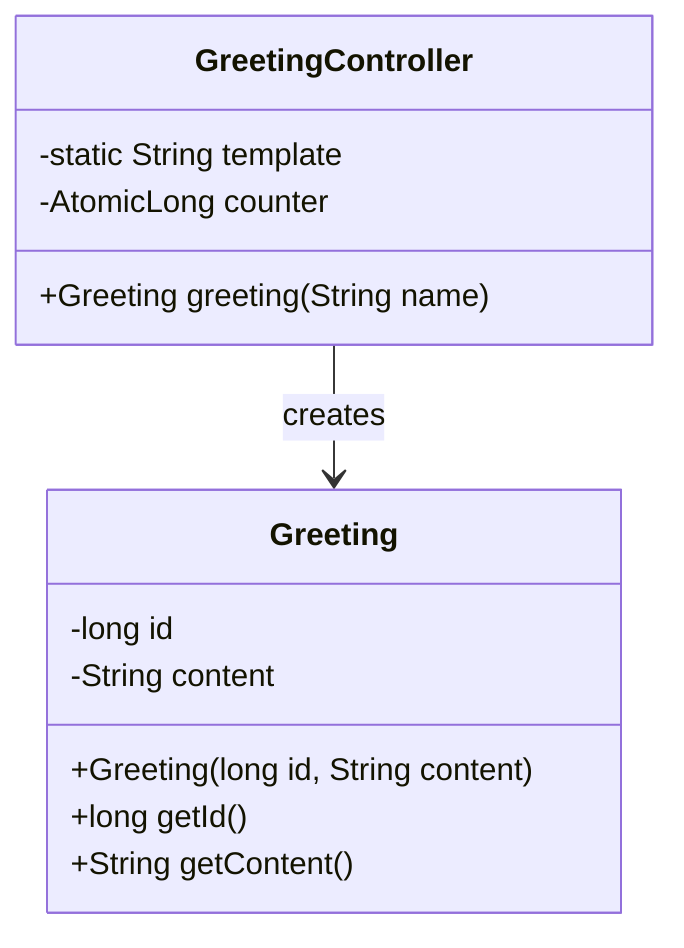

# Primeiros passos com Spring Boot

## Sumário
- [Introdução](#introdução)
- [Maven e `pom.xml`](#maven-e-pomxml)
- [Endpoint de boas vindas](#endpoint-de-boas-vindas)
- [Executando a aplicação](#executando-a-aplicação)
- [Exercício](#exercício)
- [Referências](#referências)

## Introdução

Acesse o [Spring Inizilizr](https://start.spring.io/) para configurar um modelo de projeto em branco.

Adicione as seguintes dependências e crie o projeto:
- Spring Boot DevTools
- Spring Web

Descompacte o arquivo gerado e abra a pasta criada no VSCode.

## Maven e `pom.xml`

O Maven é o gerenciador de dependência e projetos. O arquivo [pom.xml](./pom.xml) possui as configurações do projeto.

## Endpoint de boas vindas

Nesse exemplo temos um endpoint `/greeting` que retorna uma mensagem de boas vindas no formato `json`. Para isso, foram configuradas duas classes.

A primeira classe ([`Greeting`](./src/main/java/br/com/gomide/Greeting.java)) tem a função de representar o objeto retornado pelo endpoint `/greeting`. Essa classe possui os atributos `id` e `content` conforme o diagrama a seguir:



A classe [GreetingController](./src/main/java/br/com/gomide/GreetingController.java) corresponde ao controlador que receberá a requisição (request) e retornará a resposta (response).

Foram utilizadas as anotações [@RestController](./src/main/java/br/com/gomide/GreetingController.java#L9) para a configuração do controlador e [@RequestMapping](./src/main/java/br/com/gomide/GreetingController.java#L15) para a configuração do endpoint.

O método [greeting](./src/main/java/br/com/gomide/GreetingController.java#L16) recebe o parâmetro `name` e retorna um objeto da classe `Greeting`. O parâmetro `name` é mapeado pela anotação [@RequestParam](./src/main/java/br/com/gomide/GreetingController.java#L16), que é responsável por converter um parâmetro enviado durante a requisição.

## Executando a aplicação

O método main da classe [DemoApplication](./src/main/java/br/com/gomide/DemoApplication.java#L9) possui a chamada ao método `SpringApplication.run` que inicializa a aplicação.

Como esse é um projeto `Spring Web`, será inicializado um servidor Apache Tomcat e a aplicação estará pronta para ser testada.

Por padrão, o servidor web é inicializado na porta `8080` e podemos testar a aplicação a partir de um client HTTP, como por exemplo, o Thunder Client ou o Postman.

Execute as seguintes requisições:
- `GET http://localhost:8080/greeting`
- `GET http://localhost:8080/greeting?name=Denecley`

## Exercício

### 1. Endpoint para adicionar número
Crie um endpoint REST que aceita dois números como query parameters e retorna a soma desses números

#### Exemplo da requisição:
```
GET /add?a=5&b=3
```
#### Resposta esperada:
```json
{
  "result": 8
}
```


## Referências
- [Spring Initializr](https://start.spring.io/)
- [@RestController](https://docs.spring.io/spring-framework/docs/current/javadoc-api/org/springframework/web/bind/annotation/RestController.html)
- [@RequestMapping](https://docs.spring.io/spring-framework/docs/current/javadoc-api/org/springframework/web/bind/annotation/RequestMapping.html)
- [@RequestParam](https://docs.spring.io/spring-framework/docs/current/javadoc-api/org/springframework/web/bind/annotation/RequestParam.html)