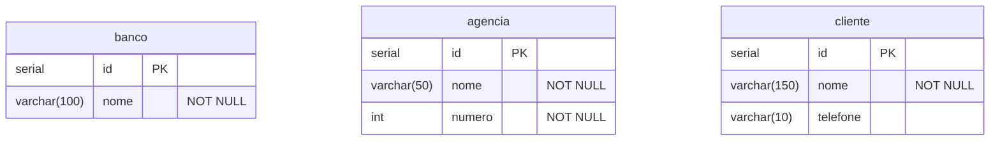

# Integrando a API ao banco de dados Postgres

## Sumário

- [Introdução](#introdução)
- [O arquivo `application.properties`](#o-arquivo-applicationproperties)
  - [Conexão com o Banco de Dados](#conexão-com-o-banco-de-dados)
  - [Configurações do JPA/Hibernate](#configurações-do-jpahibernate)
  - [Configurações do Servidor](#configurações-do-servidor)
- [A classe de modelo `Person`](#a-classe-de-modelo-person)
  - [Anotações Principais](#anotações-principais)
- [A interface `PersonRepository`](#a-interface-personrepository)
- [Exercícios](#exercícios)
- [Referências](#referências)

## Introdução

## O arquivo `application.properties`
O arquivo [application.properties](./src/main/resources/application.properties) é típico de uma aplicação Spring Boot que possui as configurações do projeto, inclusive as configurações utilizadas para conexão com banco de dados PostgreSQL. Abaixo, segue a explicação de cada uma das propriedades listadas:

### Conexão com o Banco de Dados
1. `spring.datasource.url=jdbc:postgresql://localhost:5432/people`

   Define a URL de conexão ao banco de dados. Neste caso, é um banco PostgreSQL hospedado localmente (`localhost`) na porta `5432` e o nome do banco de dados é `people`.

2. `spring.datasource.username=postgres`

    Define o nome de usuário para se conectar ao banco de dados.

3. `spring.datasource.password=aluno`  
   Define a senha do usuário especificado. Aqui, a senha é `aluno`.

4. `spring.datasource.driverClassName=org.postgresql.Driver`  
   Especifica a classe do driver JDBC que será utilizada para conectar ao banco de dados. Neste caso, é o driver do PostgreSQL.

### Configurações do JPA/Hibernate

5. `spring.jpa.show-sql=true`  
   Define se as consultas SQL geradas pelo Hibernate devem ser exibidas no console. Se definido como `true`, as consultas serão impressas no console, o que pode ser útil para depuração.

6. `spring.jpa.hibernate.dialect=org.hibernate.dialect.PostgreSQLDialect`  
   Define o "dialeto" do Hibernate, que informa ao Hibernate como gerar SQL específico para o banco de dados em uso. Neste caso, ele está configurado para o PostgreSQL.

7. `spring.jpa.properties.hibernate.jdbc.lob.non_contextual_creation=true`  
   Configuração específica do Hibernate para lidar com objetos grandes (LOBs) de maneira não contextual. Isso pode ser necessário em algumas versões do PostgreSQL para evitar erros ao manipular LOBs.

### Configurações do Servidor

8. `server.port=8080`
   Define a porta na qual a aplicação Spring Boot será executada. Neste caso, está comentado (com `#`), então o valor padrão de `8080` seria usado.

9. `server.contextPath=/app`
   Define o contexto da aplicação, ou seja, o prefixo de URL que será utilizado. Também está comentado, então o valor padrão (`/`) seria usado.

## A classe de modelo `Person`

A classe [Person](./src/main/java/br/com/gomide/model/Person.java) apresentada faz parte de um modelo de domínio em uma aplicação Java utilizando o framework Jakarta Persistence API (JPA) para mapeamento objeto-relacional (ORM). Nesta classe, várias anotações são utilizadas para definir como a classe e seus atributos serão mapeados para uma tabela de banco de dados relacional.

As anotações utilizadas nesta classe são fundamentais para definir o comportamento de persistência da entidade no banco de dados, garantindo que os dados sejam armazenados e recuperados corretamente de acordo com as regras definidas. Essas configurações tornam o processo de mapeamento objeto-relacional transparente e simplificado para o desenvolvedor.

### Anotações Principais

#### 1. `@Entity`
  
A anotação `@Entity` é usada para indicar que a classe [Person](./src/main/java/br/com/gomide/model/Person.java) é uma entidade JPA. Isso significa que ela será mapeada para uma tabela no banco de dados. Cada instância da classe `Person` representa uma linha na tabela correspondente.

#### 2. `@Table(name = "people")`

A anotação `@Table` especifica a tabela do banco de dados à qual esta entidade está mapeada. Neste caso, a classe `Person` está mapeada para a tabela chamada `people`.

#### 3. `@Id`
A anotação `@Id` marca o campo `id` como a chave primária da entidade. Isso significa que o valor desse campo será utilizado para identificar de maneira única cada instância da entidade no banco de dados.

#### 4. `@GeneratedValue(strategy = GenerationType.IDENTITY)`
A anotação `@GeneratedValue` junto com `strategy = GenerationType.IDENTITY` indica que o valor do campo `id` será gerado automaticamente pelo banco de dados, utilizando a estratégia de auto-incremento, comum em muitos SGBDs, como o PostgreSQL. A estratégia `IDENTITY` permite que o banco de dados seja responsável por gerar o valor do identificador único.

#### 5. `@Column(name = "first_name", nullable = false, length = 80)`
A anotação `@Column` é usada para mapear um campo da classe a uma coluna específica na tabela do banco de dados. Aqui, o campo `firstName` está mapeado para a coluna `first_name`, que tem as seguintes restrições:

- `nullable = false`: A coluna não pode aceitar valores nulos.
- `length = 80`: O comprimento máximo da coluna é 80 caracteres.

#### 6. `@Column(name = "last_name", nullable = false, length = 80)`
Semelhante ao campo `firstName`, o campo `lastName` está mapeado para a coluna `last_name` na tabela, com as mesmas restrições (`nullable = false`, `length = 80`).

#### 7. `@Column(length = 100)`
Para o campo `address`, a anotação `@Column` especifica que ele será mapeado para uma coluna com um comprimento máximo de 100 caracteres. Como o nome da coluna não é especificado, ele será mapeado automaticamente para uma coluna chamada `address`.

#### 8. `@Column(length = 6)`
O campo `gender` está mapeado para uma coluna com um comprimento máximo de 6 caracteres, também sem especificar explicitamente o nome da coluna.

## A interface `PersonRepository`

A interface [PersonRepository](./src/main/java/br/com/gomide/repositories/PersonRepository.java) faz parte da camada de acesso a dados em uma aplicação Spring Boot, utilizando Spring Data JPA. 

A interface PersonRepository estende `JpaRepository`, onde Person é o tipo da entidade e Long é o tipo do identificador da entidade (id). Ao estender `JpaRepository`, PersonRepository herda métodos que permitem operações como:

- `save()`: Salvar uma nova entidade ou atualizar uma entidade existente.
- `findById()`: Encontrar uma entidade pelo seu identificador.
- `findAll()`: Recuperar todas as entidades.
- `deleteById()`: Deletar uma entidade pelo seu identificador.

No contexto do projeto, a interface `PersonRepository` serve como um ponto de acesso para interagir com a tabela `people` do banco de dados. Ela abstrai a lógica de acesso a dados e fornece uma maneira simples e padronizada de realizar operações de persistência para a entidade `Person`.

## Exercícios

### 1. CRUD CRUD CRUD!!!

Crie um template de projeto em [Spring Inializr](http://start.spring.io) com as dependências:

- Spring Web
- Spring Data JPA
- PostgreSQL Driver
- Spring BootDevTools

Restaure o projeto na sua IDE de preferência (VSCode, Eclipse, Netbeans...).

Crie um banco de dados no PostgreSQL e configure a conexão com o banco de dados no arquivo `application.properties`.

Elabore um script SQL de criação do banco de dados apresentado no esquema a seguir:

Crie as respectivas classes que representam as entidades, as interfaces de repositório e os controladores para suportas as operações de CRUD.

## Referências
- [Spring Data JPA](https://docs.spring.io/spring-data/jpa/reference/jpa.html)
- [Postgres](https://www.postgresql.org/)
- [DBeaver](https://dbeaver.io/download/)

