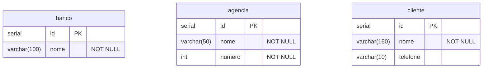

# Integrando o API ao banco de dados Postgres

## Sumário

## Introdução

## Exercícios

### 1. CRUD CRUD CRUD!!!

Crie um template de projeto em [Spring Inializr](http://start.spring.io) com as dependências:

- Spring Web
- Spring Data JPA
- PostgreSQL Driver
- Spring BootDevTools

Restaure o projeto na sua IDE de preferência (VSCode, Eclipse, Netbeans...).

Crie um banco de dados no PostgreSQL e configure a conexão com o banco de dados no arquivo `application.properties`.

Elabore um script SQL de criação do banco de dados apresentado no esquema a seguir:

Crie as respectivas classes que representam as entidades, as interfaces de repositório e os controladores para suportas as operações de CRUD.

## Referências
- [Postgres](https://www.postgresql.org/)
- [DBeaver](https://dbeaver.io/download/)
- [Spring Data JPA](https://docs.spring.io/spring-data/jpa/reference/jpa.html)

