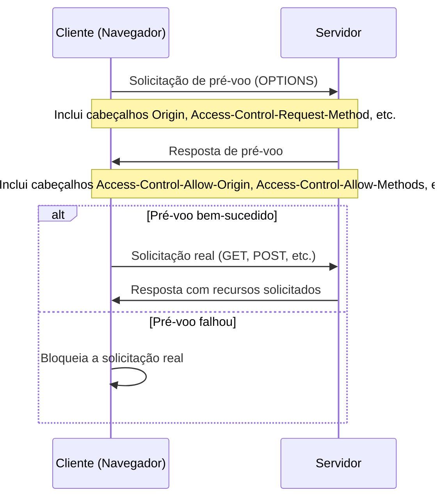

# Configurando Cross-Origin Resource Sharing (CORS)

## Sumário

- [Introdução](#introdução)
- [Habilitando o CORS no Spring Framework](#habilitando-o-cors-no-spring-framework)
- [Habilitando o CORS de forma global](#habilitando-o-cors-de-forma-global)
- [Observações](#observações)
- [Referências](#referências) 

## Introdução

o recurso de um site só pode acesar outro recurso do mesmo site se eles estiverem no mesmo domínio ([same-origin policy](https://developer.mozilla.org/en-US/docs/Web/Security/Same-origin_policy)). Mesmo endereço, subdomínio e porta.

segurança implementado pelos navegadores web que permite que recursos (como APIs) em uma página web sejam solicitados de outro domínio, fora do domínio de onde o recurso se originou. Isso é uma extensão da política de mesma origem (same-origin policy), que normalmente restringe as solicitações web a recursos do mesmo domínio por razões de segurança.

CORS funciona adicionando novos cabeçalhos HTTP que permitem que servidores especifiquem quais origens têm permissão para acessar seus recursos. Quando um navegador faz uma solicitação de origem cruzada, ele primeiro envia uma solicitação de pré-voo (preflight request) para verificar se o servidor permite a solicitação real.



## Habilitando o CORS no Spring Framework

### A anotação @CrossOrigin

Na classe [PersonController](./src/main/java/br/com/gomide/controller/PersonController.java), a anotação `@CrossOrigin` é utilizada de forma específica no método `findAll()`, demonstrando uma abordagem mais granular para o Compartilhamento de Recursos entre Origens (CORS). Vejamos como ela é aplicada:

```java
@CrossOrigin(origins = { "http://localhost:8080", "https://www.gomide.com" })
@GetMapping(produces = MediaType.APPLICATION_JSON_VALUE)
public List<PersonVO> findAll() {
  return DozerMapper.parseListObjects(
      service.findAll(),
      PersonVO.class);
}
```


Neste contexto, a estratégia adotada é mais restritiva e segura:

1. Aplicação em Nível de Método: A anotação `@CrossOrigin` é aplicada diretamente ao método `findAll()`, permitindo um controle mais fino sobre quais endpoints específicos podem ser acessados por origens cruzadas.

2. Origens Específicas: 
   - `origins = { "http://localhost:8080", "https://www.gomide.com" }`: Apenas requisições provenientes destas duas origens são permitidas. Isso inclui o ambiente de desenvolvimento local (localhost:8080) e o domínio de produção (www.gomide.com).

3. Segurança Aprimorada: Ao especificar exatamente quais origens são permitidas, esta abordagem reduz significativamente os riscos de segurança associados ao CORS, comparado a permitir todas as origens ("*").

4. Flexibilidade de Desenvolvimento: A inclusão de "http://localhost:8080" facilita o desenvolvimento e testes locais, enquanto "https://www.gomide.com" permite o acesso em produção.

Esta configuração demonstra um equilíbrio entre segurança e praticidade, permitindo o acesso necessário para desenvolvimento e produção, enquanto restringe o acesso de origens não autorizadas. É uma prática recomendada para proteger endpoints específicos em APIs RESTful.

## Habilitando o CORS de forma global

Adicionar a configuração `cors.originPatterns` no arquivo [application.properties](./src/main/resources/application.properties#L24). 

Implementar uma classe de configuração utilizando a anotação [@Configuration](https://docs.spring.io/spring-framework/reference/core/beans/java/configuration-annotation.html).


A classe [WebConfig](./src/main/java/br/com/gomide/config/WebConfig.java) é responsável por configurar o CORS para a aplicação Spring. Essa configuração foi realizada nas seguintes etapas:

1. **Anotações e Implementação**

```java
@Configuration
public class WebConfig implements WebMvcConfigurer {
```

- A classe é anotada com `@Configuration`, indicando que é uma classe de configuração do Spring.
- Ela implementa `WebMvcConfigurer`, permitindo personalizar a configuração MVC do Spring.

2. **Definição de Padrões de Origem**

```java
@Value("${cors.originPatterns}")
private String corsOriginPatterns = "";
```

- Usa `@Value` para injetar valores de propriedades de configuração.
- `corsOriginPatterns` armazena padrões de origem permitidos, definidos na configuração `cors.originPatterns` do arquivo [application.properties](./src/main/resources/application.properties#L24).

3. **Configuração de CORS**

```java
@Override
public void addCorsMappings(CorsRegistry registry) {
```

- Sobrescreve o método `addCorsMappings` para configurar as regras de CORS.

4. **Primeira Regra de CORS**

```java
String[] allowedPatterns = corsOriginPatterns.split(",");

registry.addMapping("/**")
    .allowedOrigins(allowedPatterns)
    .allowedMethods("*")
    .allowCredentials(true);
```

- Divide a string `corsOriginPatterns` em um array de padrões permitidos.
- Aplica esta regra a todos os endpoints (`"/**"`).
- Permite origens específicas definidas em `allowedPatterns`.
- Permite todos os métodos HTTP (`"*"`).
- Permite o envio de credenciais (como cookies) nas requisições.

5. **Segunda Regra de CORS**
```java
registry.addMapping("/**")
    .allowedOrigins("*")
    .allowedMethods("GET");
```
- Adiciona uma segunda regra que se aplica a todos os endpoints.
- Permite requisições de qualquer origem (`"*"`).
- Restringe apenas para o método HTTP GET.

## Observações

A configuração do projeto atual tem duas regras que podem entrar em conflito. A segunda regra (`allowedOrigins("*")`) é mais permissiva e pode sobrescrever a primeira para requisições GET.

Além disso, é importante revisar se esta configuração atende aos requisitos de segurança da aplicação, especialmente a regra que permite todas as origens para GET.

## Referências
- [Using the @Configuration annotation](https://docs.spring.io/spring-framework/reference/core/beans/java/configuration-annotation.html)
- [Cross-Origin Resource Sharing (CORS)](https://developer.mozilla.org/pt-BR/docs/Web/HTTP/CORS)