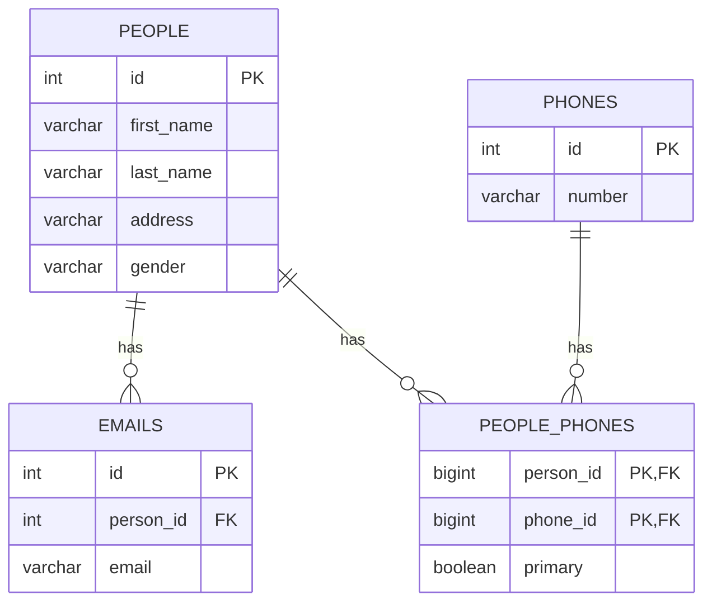

# Mapeando os relacionamentos

## Sumário

- [Introdução](#introdução)
- [Modelo de dados](#modelo-de-dados)
- [Mapeamento entre as classes](#mapeamento-entre-as-classes)
  - [Associações utilizadas neste projeto](#associações-utilizadas-neste-projeto)
- [Rotas](#rotas)
  - [Pessoas](#pessoas)
  - [Telefones](#telefones)
  - [Emails](#emails)
- [Referências](#referências)
## Introdução

Este projeto tem como objetivo demonstrar como mapear relacionamentos entre entidades em um banco de dados relacional utilizando JPA e Spring Boot. Foram exploradas as associações `@OneToMany` e `@ManyToOne`.

## Modelo de dados

## Mapeamento entre as classes

As classes [Person](./src/main/java/br/com/gomide/model/Person.java), [Phone](./src/main/java/br/com/gomide/model/Phone.java) e [Email](./src/main/java/br/com/gomide/model/Email.java) estão mapeadas para as tabelas `people`, `phones` e `emails` respectivamente. Além disso, a classe [PersonPhone](./src/main/java/br/com/gomide/model/PersonPhone.java) mapeia a tabela associativa `people_phones`.

### Associações utilizadas neste projeto

#### Entre `People` e `Email`:

- [@OneToMany](./src/main/java/br/com/gomide/model/Person.java#L37) - Uma pessoa pode ter vários emails.
- [@ManyToOne](./src/main/java/br/com/gomide/model/Email.java#L27) - Um email pertence a uma pessoa.

#### Entre `People` e `Phone`:

Essa associação é mapeada por meio de uma classe associativa [PersonPhone](./src/main/java/br/com/gomide/model/PersonPhone.java). A classe [PersonPhoneId](./src/main/java/br/com/gomide/model/PersonPhoneId.java) é utilizada para mapear a chave composta a partir da anotação [@EmbeddedId](./src/main/java/br/com/gomide/model/PersonPhone.java#L14).

Assim, temos:

- [@OneToMany](./src/main/java/br/com/gomide/model/Person.java#L40) - Uma pessoa pode ter vários telefones.
- [@OneToMany](./src/main/java/br/com/gomide/model/Phone.java#L24) - Um telefone pertence a várias pessoa.

## Rotas

As rotas estão organizadas em três grupos: `Pessoas`, `Telefones` e `Emails`. Cada grupo possui um conjunto de rotas que podem ser utilizadas para interagir com o banco de dados.

O arquivo [postman-collection_associationCollection.json](./postman-collection_associationCollection.json) contém todas as rotas organizadas para serem importadas em uma coleção do Postman.

### Pessoas
- `GET /api/v1/people` - Listar todas as pessoas
- `GET /api/v1/people/{id}` - Buscar uma pessoa pelo ID
- `POST /api/v1/people` - Criar uma pessoa
- `PUT /api/v1/people/{id}` - Atualizar uma pessoa
- `DELETE /api/v1/people/{id}` - Excluir uma pessoa

### Telefones
- `GET /api/v1/phones` - Listar todos os telefones
- `GET /api/v1/phones/{id}` - Buscar um telefone pelo ID
- `POST /api/v1/phones` - Criar um telefone
- `PUT /api/v1/phones/{id}` - Atualizar um telefone
- `DELETE /api/v1/phones/{id}` - Excluir um telefone

### Telefones de uma pessoa
- `GET /api/v1/people/{personId}/phones` - Listar todos os telefones de uma pessoa
- `POST /api/v1/people/{personId}/phones/{phoneId}` - Criar um telefone para uma pessoa
- `DELETE /api/v1/people/{personId}/phones/{phoneId}` - Excluir um telefone de uma pessoa

### Emails

Como os emails estão relacionados obrigatoriamente a uma pessoa, as rotas do tipo `GET` e `POST` precisam receber o `personId` como parâmetro.

- `GET /api/v1/people/{personId}/emails` - Listar todos os emails de uma pessoa
- `POST /api/v1/people/{personId}/emails` - Criar um email para uma pessoa
- `PUT /api/v1/emails/{id}` - Atualizar um email
- `DELETE /api/v1/emails/{id}` - Excluir um email

## Referências
- [Generate Data](https://generatedata.com/generator)
- [Hibernate One to Many Annotation Tutorial](https://www.baeldung.com/hibernate-one-to-many)
- [3. Many-to-Many Using a Composite Key](https://www.baeldung.com/jpa-many-to-many#many-to-many-using-a-composite-key)
- [Spring Data Repository](https://docs.spring.io/spring-data/jpa/reference/repositories/query-keywords-reference.html)
